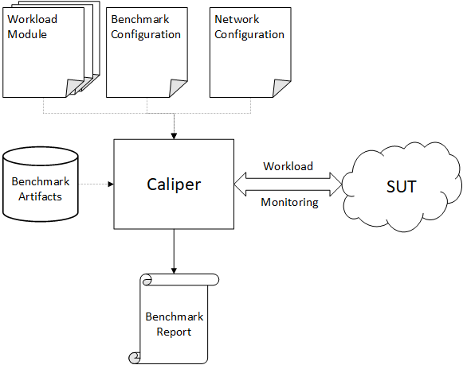
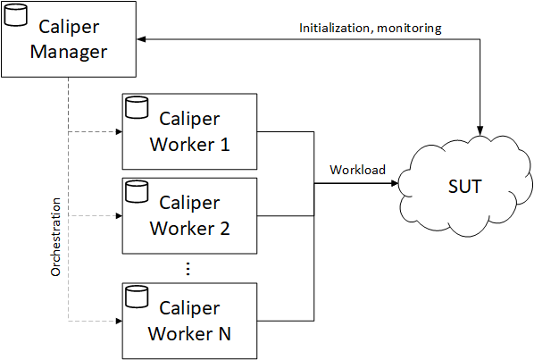
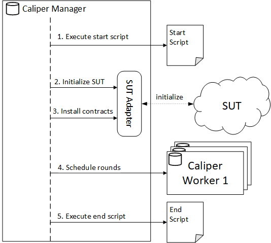
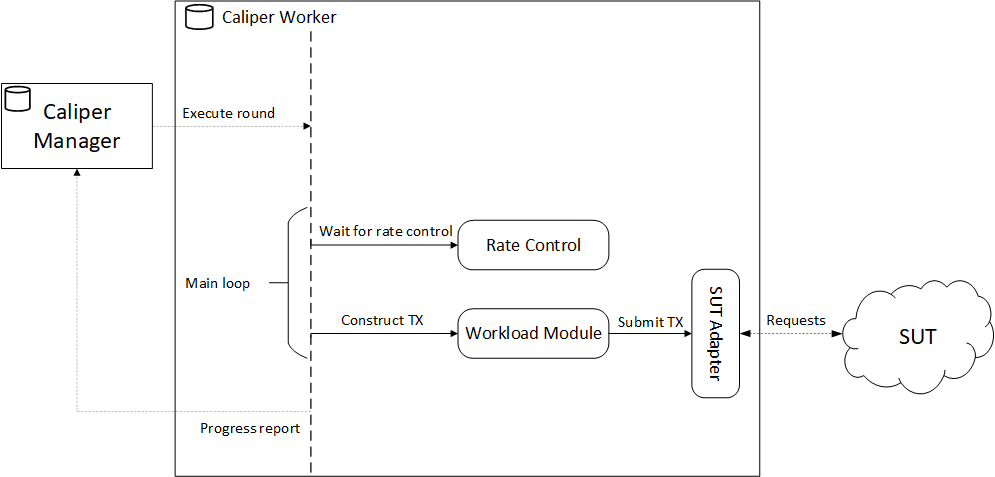
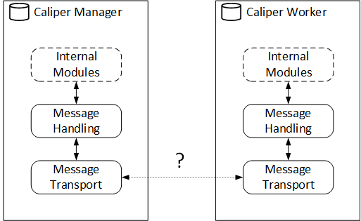
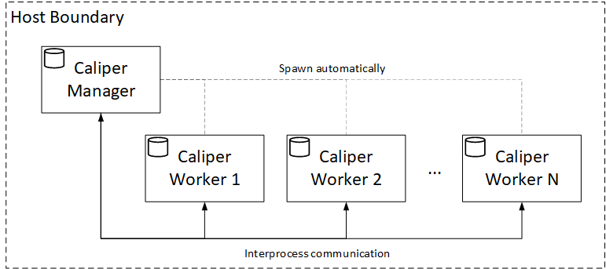
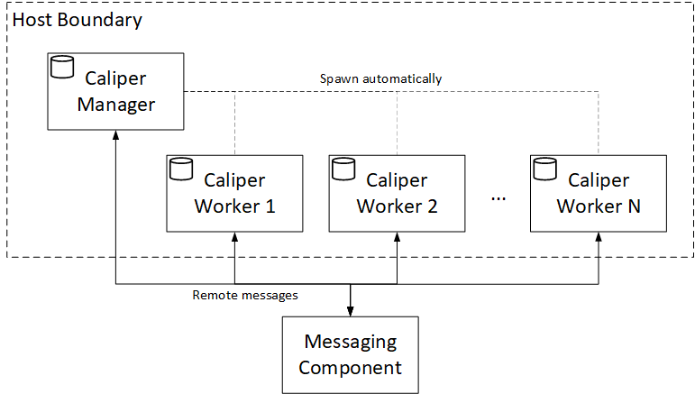
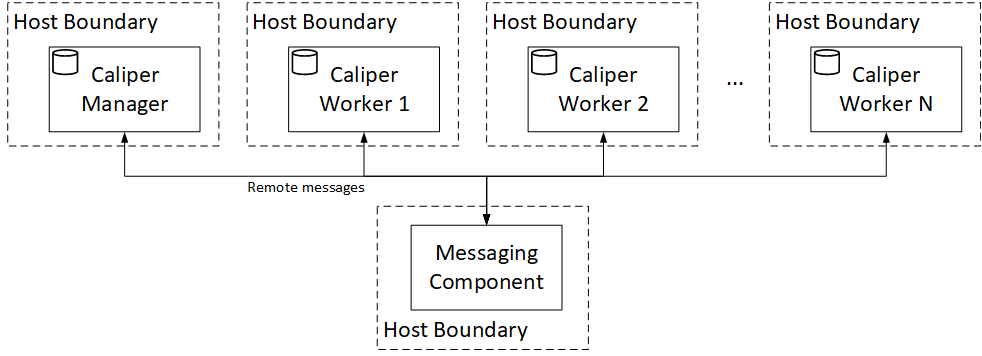

# Architecture

## Overview

Caliper is a general framework for executing benchmarks against different blockchain platforms. Caliper was designed with scalability and extensibility in mind to easily integrate with today’s popular monitoring and infrastructure solutions. Accordingly, the architecture of Caliper can seem a bit complicated at first.

This page aims to gradually ease you into the intricacies of Caliper’s architecture, taking one step at a time. By the end of this page, you should be familiar with the general concepts and API of Caliper. As you read along, you will find references to other, more technical documentation pages. Feel free to explore them once you are familiar with the basic building blocks of Caliper.

## Bird’s eye view
At its most simple form, Caliper is a service that generates a workload against a specific system under test (SUT) and continuously monitors its responses. Finally, Caliper generates a report based on the observed SUT responses. This simplistic view is depicted in the following figure.

Caliper requires several inputs to run a benchmark, independently of the used SUT. The following subsections give a brief overview of these inputs.

### Benchmark configuration file
The benchmark configuration file describes how the benchmark should be executed. It tells Caliper how many rounds it should execute, at what rate the TXs should be submitted, and which module will generate the TX content. It also includes settings about monitoring the SUT.

You can consider this file as the “flow orchestrator” of the benchmark. For the most part, the settings are independent of the SUT, so you can easily reuse them when performing multiple benchmarks against different SUT types or versions.

!!! note

    *For a more technical introduction to the benchmark configuration file, see the [corresponding page](https://hyperledger.github.io/caliper/v0.5.0/overview/bench-config/).*

### Network configuration file
The content of the network configuration file is SUT-specific. The file usually describes the topology of the SUT, where its nodes are (their endpoint addresses), what identities/clients are present in the network, and what smart contracts Caliper should deploy or interact with.

For the exact structure of the network configuration files, refer to the corresponding SUT connector documentations (we will discuss connectors a bit later on this page):

- [Hyperledger Besu & Ethereum](https://hyperledger.github.io/caliper/v0.5.0/connector-configuration/ethereum-config/)
- [Hyperledger Fabric](https://hyperledger.github.io/caliper/v0.5.0/connector-configuration/fabric-config.md)
- [FISCO BCOS](https://hyperledger.github.io/caliper/v0.5.0/connector-configuration/fisco-config/)

### Workload modules

Workload modules are the brain of a benchmark. Since Caliper is a general benchmark framework, it does not include any concrete benchmark implementation. When Caliper schedules TXs for a given round, it is the task of the round’s workload module to generate the content of the TXs and submit it. Each round can have a different associated workload module, so separating your workload implementation based on phases/behavior should be easy.

Workload modules are simply Node.JS modules that must export a given factory function. Other than that, the workload module logic can be arbitrary. Really, anything you can code in Node.JS.

!!! note

    *For a more technical introduction to the benchmark configuration file, see the [corresponding page](https://hyperledger.github.io/caliper/v0.5.0/overview/workload-module/).*

### Benchmark artifacts
There might be additional artifacts necessary to run a benchmark that can vary between different benchmarks and runs. These usually include the followings:

- Crypto materials necessary to interact with the SUT.
- Smart contract source code for Caliper to deploy (if the SUT connector supports such operation).
- [Runtime configuration](https://hyperledger.github.io/caliper/v0.5.0/reference/runtime-config/) files.
- Pre-installed third party packages for your workload modules.

Refer to the SUT connector configuration pages for the additional necessary artifacts.

!!! note

    *From here on out, we will refer to the introduced Caliper inputs simply as benchmark artifacts and denote them with the database symbol seen in the first figure.*

## Multi-platform support
Before we further dive into the architecture of Caliper, let’s see how Caliper can support multiple SUT types. Caliper uses connector modules to hide the peculiarities of different SUT types and provide a unified interface towards the Caliper (and external) modules.

A SUT connector provides a simplified interface towards internal Caliper modules, as well as towards the workload modules. Accordingly, Caliper can request the execution of simple things, like “initialize the connector/SUT”, and the connector implementation will take care of the rest. The exact tasks to perform during the initialization are often determined by the content of the network configuration file (and by the remote administrative actions the SUT supports).

!!! note

    *For the technical details of how to implement a connector, refer to the [corresponding page](https://hyperledger.github.io/caliper/v0.5.0/reference/writing-connectors/).*

## Caliper processes
Caliper considers scalability one of its most important goals (besides extensibility/flexibility). Workload generation from a single machine can quickly reach the resource limitations of the machine. If we want the workload rate to match the scalability and performance characteristics of the evaluated SUT then we need a distributed approach!

Accordingly, Caliper (as a framework) comprises of two different services/processes: a manager process and numerous worker processes.

- The manager process initializes the SUT (if supported) and coordinates the run of the benchmark (i.e., schedules the configured rounds) and handles the performance report generation based on the observed TX statistics.
- The worker processes perform the actual workload generation, independently of each other. Even if a worker process reaches the limits of its host machine, using more worker processes (on multiple machines) can further increase the workload rate of Caliper. Thus worker processes are the backbone of Caliper’s scalability.

The described setup is illustrated in the next figure.

!!! note

    *For the time being, we will ignore the technical details of the distributed architecture, like the messaging between the processes. We will come back to it in a later section.*

### The manager process
The Caliper manager process is the orchestrator of the entire benchmark run. It goes through several predefined stages as depicted by the figure below.

1. In the first stage, Caliper executes the startup script (if present) from the network configuration file. This step is mainly useful for local Caliper and SUT deployments as it provides a convenient way to start the network and Caliper in one step.

!!!note
    *The deployment of the SUT is not the responsibility of Caliper. Technically, Caliper only connects to an already running SUT, even if it was started through the startup script.*

2. In the second stage, Caliper initializes the SUT. The tasks performed here are highly dependent on the capabilities of the SUT and the SUT connector. For example, the Hyperledger Fabric connector uses this stage to create/join channels and register/enroll new users.
3. In the third stage, Caliper deploys the smart contracts to the SUT, if the SUT and the connector support such operation (like with the Hyperledger Fabric connector).
4. In the fourth stage Caliper schedules and executes the configured rounds through the worker processes. This is the stage where the workload generation happens (through the workers!).
5. In the last stage, after executing the rounds and generating the report, Caliper executes the cleanup script (if present) from the network configuration file. This step is mainly useful for local Caliper and SUT deployments as it provides a convenient way to tear down the network and any temporary artifacts.

If your SUT is already deployed an initialized, then you only need Caliper to execute the rounds and nothing else. Luckily, you can configure every stage one-by-one whether it should be executed or not. See the [flow control settings](https://hyperledger.github.io/caliper/v0.5.0/reference/runtime-config/#benchmark-phase-settings) for details.

The above figure only shows the high-level steps of executing a benchmark. Some components are omitted for the sake of simplicity, like the resource and transaction monitor components. To learn more about the purpose and configuration of these components, refer to the [Resource and Transaction Monitors](https://hyperledger.github.io/caliper/v0.5.0/reference/caliper-monitors/) documentation page.

### The worker process
The interesting things (from a user perspective) happen inside the worker processes. A worker process starts its noteworthy tasks when the manager process sends a message to it about executing the next round (the 4th step in the previous section). The important components of a worker process are shown in the figure below.

The worker process spends most of its time in the workload generation loop. The loop consists of two important steps:

1. Waiting for the rate controller to enable the next TX. Think of the rate controller as a delay circuit. Based on what kind of rate controller is used, it delays/halts the execution of the worker (in an asynchronous manner) before enabling the next TX. For example, if a fixed 50 TXs per second (TPS) rate is configured, the rate controller will halt for 20ms between each TX.

!!!note
    *The rate controllers of each round can be configured in the [benchmark configuration file](https://hyperledger.github.io/caliper/v0.5.0/overview/bench-config/). For the available rate controllers, see the [Rate Controllers](https://hyperledger.github.io/caliper/v0.5.0/reference/rate-controllers/) page.*

2. Once the rate controller enables the next TX, the worker gives control to the workload module. The workload module assembles the parameters of the TX (specific to the SUT and smart contract API) and calls the simple API of the SUT connector that will, in turn, send the TX request to the SUT (probably using the SDK of the SUT).

!!!note
    *The workload modules of each round can be configured in the [benchmark configuration file](https://hyperledger.github.io/caliper/v0.5.0/overview/bench-config/). For the technical details of workload modules, see the [Workload Modules](https://hyperledger.github.io/caliper/v0.5.0/reference/workload-module/) page.*

During the workload loop, the worker process sends progress updates to the manager process. Progress reporting on the manager side can be enabled and configured with the `caliper-progress-reporting-enabled and caliper-progress-reporting-interval` setting keys. For details, see the [Basic Runtime Settings](https://hyperledger.github.io/caliper/v0.5.0/reference/runtime-config/#basic-settings).

## Process distribution models
The last part of the architecture discussion is demystifying the worker process management. Based on how worker processes are started and what messaging method is used between the manager and worker processes, we can distinguish the following distribution/deployment models:

1. Automatically spawned worker processes on the same host, using interprocess communication (IPC) with the manager process.
2. Automatically spawned worker processes on the same host, using a remote messaging mechanism with the manager process.
3. Manually started worker processes on an arbitrary number of hosts, using a remote messaging mechanism with the manager process.

Even though the third method is the way to go for more complex scenarios, the first two methods can help you get familiar with Caliper, and gradually aid you with the transition to the third method.

### Modular message transport
The different deployment approaches are made possible by how Caliper handles messaging internally, as shown by the following figure.

The internal Caliper modules only deal with predefined messages whose content is independent of how the messages are sent. The module that sends the messages between the processes is swappable, thus enabling different communication methods.

The deployment model is configurable with the following two setting keys:

- `caliper-worker-remote`: if set to `false` (the default), then the manager process will spawn the required number of worker processes locally, resulting in the models 1 or 2.
- `caliper-worker-communication-method`: can take the values `process` (the default) or `mqtt` and determines the message transport implementation to use. The process communication corresponds to the first model, while `mqtt` denotes models 2 and 3.

The following table summarizes the different models and how to select them:

| `remote` value | `method` value | Corresponding deployment model                                           |
|----------------|----------------|--------------------------------------------------------------------------|
| `false`        | `process`      | 1. Interprocess communication with local workers                          |
| `false`        | `mqtt`         | 2. Remote messaging-based communication with local workers                |
| `true`         | `mqtt`         | 3. Remote messaging-based communication with remote workers               |
| `true`         | `process`      | Invalid, since IPC does not apply to remote communication                 |

!!! note

    *For the technical details on configuration the messaging transport, see the [Messengers](https://hyperledger.github.io/caliper/v0.5.0/reference/caliper-messengers/) page.*

### Interprocess communication
The examples on the [Install & Usage](https://hyperledger.github.io/caliper/v0.5.0/overview/installing-caliper/) page all use the IPC approach since it is the default behavior. The setup is illustrated in the figure below.

The `caliper launch manager` CLI command starts the manager process, which in turn will automatically spawn the configured number of worker processes (using the `caliper launch worker` CLI command). The communication between the processes is IPC, utilizing the built-in Node.JS method available for the parent-children process relationships.

This is the simplest deployment model for Caliper, requiring no additional configuration and third party messaging components. Accordingly, it is ideal when you first start using Caliper, or when you are still assembling the benchmark artifacts for your project, and just quickly want to test them.

Unfortunately, this model is constrained to a single host, thus suffers from scalability issues in the sense that only vertical scalability of the host is possible.

### Local message broker communication
As a stepping stone towards the fully-distributed setup, the second deployment model replaces IPC with a third party messaging solution, while still hiding the worker process management from the user. The setup is illustrated in the figure below.

Like before, the `caliper launch manager` CLI command starts the manager process, which in turn will automatically spawn the configured number of worker processes (using the `caliper launch worker` CLI command). However, the messaging happens through a separate component, which could be deployed anywhere as long as its endpoint is reachable by the Caliper processes.

Unfortunately, this model is also constrained to a single host from the aspect of the Caliper processes. However, it is a useful model for taking your deployment to the next level once your benchmark artifacts are in place. Once you successfully integrated the messaging component, you are ready to move to the fully distributed Caliper setup.

### Distributed message broker communication
When you take the management of the worker processes into your own hands, that’s when the full potential of Caliper is unlocked. At this point, you can start as many workers on as many hosts as you would like, using the `caliper launch worker` CLI command. The setup is illustrated in the figure below.

The fully distributed deployment enables the horizontal scaling of the worker processes, greatly increasing the achievable workload rate. To ease the management of the many Caliper processes, you will probably utilize some automatic deployment/management solution, like Docker Swarm or Kubernetes. Luckily, the flexibility of the [Caliper Docker image](https://hyperledger.github.io/caliper/v0.5.0/overview/installing-caliper/#using-the-docker-image) makes such integration painless.

However, there are some caveats you have to keep in mind:

1. Distributing the necessary benchmark artifacts to the Caliper processes is your responsibility. Different infrastructure solutions provide different means for this, so check your favorite vendor’s documentation.
2. Setting up proper networking in distributed systems is always a challenge. Make sure that the Caliper processes can access the configured messaging component and the SUT components.
3. A single host may run multiple Caliper worker processes. When planning the worker distribution (or setting resource requirements for container management solutions) make sure that enough resources are allocated for workers to keep the configured TX scheduling precision.

## License

The Caliper codebase is released under the [Apache 2.0 license](https://hyperledger.github.io/caliper/v0.5.0/general/license/). Any documentation developed by the Caliper Project is licensed under the Creative Commons Attribution 4.0 International License. You may obtain a copy of the license, titled CC-BY-4.0, at [http://creativecommons.org/licenses/by/4.0/](http://creativecommons.org/licenses/by/4.0/).